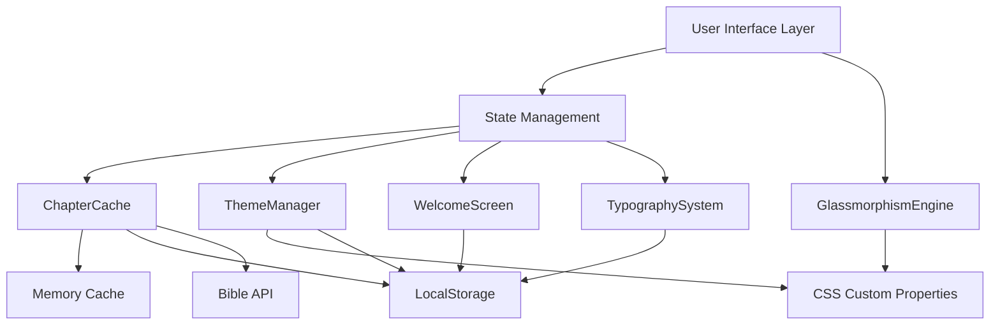
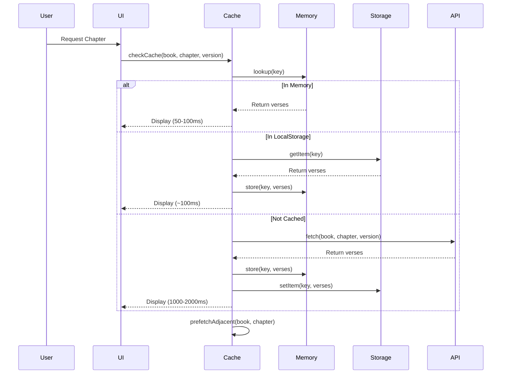
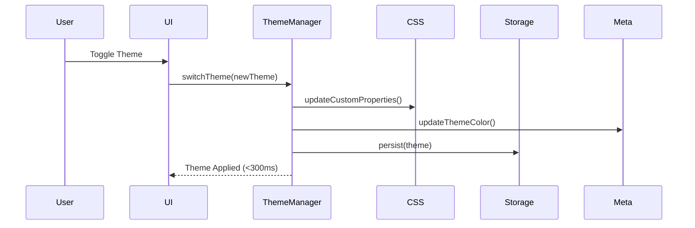

# Design Document: App UI Polish and Performance

## Overview

This design enhances Tracy's Bible PWA with performance optimizations through intelligent caching, modern glassmorphism UI design, personalized welcome experience, comprehensive light/dark theme support, improved typography for readability, optimized spacing for content density, and iOS-native polish patterns.

### Goals

1. **Performance**: Implement multi-tier caching (memory + LocalStorage) with LRU eviction to achieve <100ms cached chapter loads and <2000ms API loads
2. **Visual Design**: Apply glassmorphism effects (backdrop blur, transparency, depth) to navigation, cards, modals, and menus
3. **Personalization**: Create welcome screen with customizable greeting, inspirational verse, session management, and smooth transitions
4. **Theme System**: Implement comprehensive light/dark theme support with system preference detection, accessible contrast ratios, and persistent user preferences
5. **Typography**: Enhance readability with larger base sizes (17px body, 18px verses), adjustable sizing (15-26px range), optimal line heights (1.6-1.8), and iOS system fonts
6. **Layout Optimization**: Maximize content area (85%+ viewport) through compact spacing, efficient navigation (66px + safe area), and iPhone-specific safe area handling
7. **iOS Polish**: Implement native-feeling interactions with spring animations (300ms), momentum scrolling, haptic-style feedback, appropriate corner radii, and standalone mode configuration

### Core Components

- **ChapterCache**: LRU cache manager with memory + LocalStorage tiers, version-aware keying, prefetching logic, and quota management
- **ThemeManager**: CSS custom properties controller with system preference detection, LocalStorage persistence, and theme-color meta updates
- **WelcomeScreen**: Personalized onboarding overlay with session detection, name customization, verse display, and fade transitions
- **GlassmorphismEngine**: CSS utilities for backdrop blur effects with theme-adaptive opacity and subtle borders
- **TypographySystem**: Font size controller with user adjustments, LocalStorage persistence, and iOS font stack
- **LayoutOptimizer**: Safe area utilities and spacing constants for compact, efficient layouts

## Architecture

### System Architecture



### Data Flow

#### Chapter Loading Flow


#### Theme Switch Flow


### Module Structure

```
js/
├── app.js (existing - main state & routing)
├── caching.js (new)
│   ├── ChapterCache class
│   ├── LRU eviction logic
│   ├── Prefetch coordinator
│   └── Storage quota manager
├── themes.js (new)
│   ├── ThemeManager class
│   ├── System preference detection
│   ├── CSS variable updates
│   └── Meta tag synchronization
├── welcome.js (new)
│   ├── WelcomeScreen component
│   ├── Session detection
│   ├── Name customization
│   └── Transition animations
└── utils.js (new)
    ├── Typography utilities
    ├── Toast notifications
    └── Safe area helpers

css/
├── style.css (existing - to be enhanced)
├── themes.css (new)
│   ├── Light theme variables
│   ├── Dark theme variables
│   └── Theme transition classes
├── glassmorphism.css (new)
│   ├── Backdrop blur utilities
│   ├── Transparency scales
│   └── Border highlights
├── typography.css (new)
│   ├── Font size scales
│   ├── Line height definitions
│   └── iOS font stacks
└── ios-polish.css (new)
    ├── Spring animations
    ├── Touch interactions
    └── Safe area handling
```

## Components and Interfaces

### ChapterCache

Manages efficient chapter storage and retrieval with LRU eviction and intelligent prefetching.

```javascript
class ChapterCache {
  constructor() {
    this.memoryCache = new Map(); // Fast in-memory cache
    this.accessLog = new Map();    // For LRU tracking
    this.maxMemorySize = 50;       // Memory cache limit
    this.maxStorageSize = 100;     // LocalStorage limit
    this.prefetchQueue = new Set();
  }

  /**
   * Generate cache key for chapter
   * @param {string} book - Book name
   * @param {number} chapter - Chapter number
   * @param {string} version - Bible version
   * @returns {string} Cache key
   */
  getCacheKey(book, chapter, version) {
    return `${version}:${book}:${chapter}`;
  }

  /**
   * Retrieve chapter from cache or API
   * @param {string} book - Book name
   * @param {number} chapter - Chapter number
   * @param {string} version - Bible version
   * @returns {Promise<Array>} Verse array
   */
  async getChapter(book, chapter, version) {
    const key = this.getCacheKey(book, chapter, version);
    this.updateAccessLog(key);

    // Check memory cache
    if (this.memoryCache.has(key)) {
      return this.memoryCache.get(key).verses;
    }

    // Check LocalStorage
    const cached = this.getFromStorage(key);
    if (cached) {
      this.addToMemory(key, cached);
      return cached.verses;
    }

    // Fetch from API
    const verses = await this.fetchFromAPI(book, chapter, version);
    const cacheEntry = {
      verses,
      version,
      timestamp: Date.now(),
      accessCount: 1
    };
    
    this.addToMemory(key, cacheEntry);
    this.saveToStorage(key, cacheEntry);
    
    // Trigger prefetch
    this.prefetchAdjacent(book, chapter, version);
    
    return verses;
  }

  /**
   * Add entry to memory cache with LRU eviction
   */
  addToMemory(key, entry) {
    if (this.memoryCache.size >= this.maxMemorySize) {
      this.evictLRU();
    }
    this.memoryCache.set(key, entry);
  }

  /**
   * Evict least recently used entry from memory
   */
  evictLRU() {
    let oldestKey = null;
    let oldestTime = Infinity;
    
    for (const [key, time] of this.accessLog.entries()) {
      if (time < oldestTime) {
        oldestTime = time;
        oldestKey = key;
      }
    }
    
    if (oldestKey) {
      this.memoryCache.delete(oldestKey);
      this.accessLog.delete(oldestKey);
    }
  }

  /**
   * Update access timestamp for LRU tracking
   */
  updateAccessLog(key) {
    this.accessLog.set(key, Date.now());
  }

  /**
   * Prefetch adjacent chapters in background
   */
  async prefetchAdjacent(book, chapter, version) {
    const chapterCount = CHAPTER_COUNTS[book] || 1;
    const toFetch = [];
    
    if (chapter > 1) {
      toFetch.push({ book, chapter: chapter - 1, version });
    }
    if (chapter < chapterCount) {
      toFetch.push({ book, chapter: chapter + 1, version });
    }
    
    for (const item of toFetch) {
      const key = this.getCacheKey(item.book, item.chapter, item.version);
      if (!this.memoryCache.has(key) && !this.prefetchQueue.has(key)) {
        this.prefetchQueue.add(key);
        // Use setTimeout to avoid blocking main thread
        setTimeout(() => {
          this.getChapter(item.book, item.chapter, item.version)
            .finally(() => this.prefetchQueue.delete(key));
        }, 100);
      }
    }
  }

  /**
   * Save entry to LocalStorage with quota management
   */
  saveToStorage(key, entry) {
    try {
      const storageKey = `tb_cache_${key}`;
      localStorage.setItem(storageKey, JSON.stringify(entry));
      
      // Track cache size
      this.manageStorageQuota();
    } catch (e) {
      if (e.name === 'QuotaExceededError') {
        this.clearOldestStorageEntries(5);
        try {
          localStorage.setItem(storageKey, JSON.stringify(entry));
        } catch (e2) {
          console.warn('Failed to cache chapter after cleanup');
        }
      }
    }
  }

  /**
   * Retrieve entry from LocalStorage
   */
  getFromStorage(key) {
    try {
      const storageKey = `tb_cache_${key}`;
      const item = localStorage.getItem(storageKey);
      if (item) {
        const entry = JSON.parse(item);
        entry.accessCount = (entry.accessCount || 0) + 1;
        // Update access count in storage
        this.saveToStorage(key, entry);
        return entry;
      }
    } catch (e) {
      console.warn('Failed to read from cache', e);
    }
    return null;
  }

  /**
   * Clear oldest entries from LocalStorage
   */
  clearOldestStorageEntries(count) {
    const entries = [];
    for (let i = 0; i < localStorage.length; i++) {
      const key = localStorage.key(i);
      if (key.startsWith('tb_cache_')) {
        const entry = JSON.parse(localStorage.getItem(key));
        entries.push({ key, timestamp: entry.timestamp });
      }
    }
    
    entries.sort((a, b) => a.timestamp - b.timestamp);
    entries.slice(0, count).forEach(e => localStorage.removeItem(e.key));
  }

  /**
   * Manage storage quota - keep under 100 chapters
   */
  manageStorageQuota() {
    const cacheKeys = [];
    for (let i = 0; i < localStorage.length; i++) {
      const key = localStorage.key(i);
      if (key.startsWith('tb_cache_')) {
        cacheKeys.push(key);
      }
    }
    
    if (cacheKeys.length > this.maxStorageSize) {
      const excess = cacheKeys.length - this.maxStorageSize;
      this.clearOldestStorageEntries(excess);
    }
  }

  /**
   * Clear all cached chapters
   */
  clearAll() {
    this.memoryCache.clear();
    this.accessLog.clear();
    
    const keys = [];
    for (let i = 0; i < localStorage.length; i++) {
      const key = localStorage.key(i);
      if (key.startsWith('tb_cache_')) {
        keys.push(key);
      }
    }
    keys.forEach(k => localStorage.removeItem(k));
  }

  /**
   * Clear version-specific cache
   */
  clearVersion(version) {
    // Clear memory cache
    const memKeys = Array.from(this.memoryCache.keys());
    memKeys.forEach(key => {
      if (key.startsWith(`${version}:`)) {
        this.memoryCache.delete(key);
        this.accessLog.delete(key);
      }
    });
    
    // Clear LocalStorage
    const storageKeys = [];
    for (let i = 0; i < localStorage.length; i++) {
      const key = localStorage.key(i);
      if (key.startsWith(`tb_cache_${version}:`)) {
        storageKeys.push(key);
      }
    }
    storageKeys.forEach(k => localStorage.removeItem(k));
  }

  /**
   * Get cache statistics
   */
  getStats() {
    const cacheKeys = [];
    for (let i = 0; i < localStorage.length; i++) {
      const key = localStorage.key(i);
      if (key.startsWith('tb_cache_')) {
        cacheKeys.push(key);
      }
    }
    
    return {
      memorySize: this.memoryCache.size,
      storageSize: cacheKeys.length,
      prefetchQueue: this.prefetchQueue.size
    };
  }

  /**
   * Fetch chapter from API
   */
  async fetchFromAPI(book, chapter, version) {
    const url = `https://bible-api.com/${encodeURIComponent(book)}+${chapter}?translation=${version}`;
    const res = await fetch(url);
    if (!res.ok) throw new Error('API fetch failed');
    const data = await res.json();
    return data.verses || [];
  }
}
```

### ThemeManager

Manages theme state, CSS custom properties, and system preference detection.

```javascript
class ThemeManager {
  constructor() {
    this.currentTheme = this.loadTheme();
    this.themes = {
      light: {
        // Background colors
        '--bg-primary': '#ffffff',
        '--bg-secondary': '#f8f9fa',
        '--bg-tertiary': '#e9ecef',
        
        // Card backgrounds
        '--card-bg': 'rgba(255, 255, 255, 0.7)',
        '--card-border': 'rgba(194, 24, 91, 0.15)',
        
        // Text colors
        '--text-primary': '#1a1a1a',
        '--text-secondary': '#4a4a4a',
        '--text-tertiary': '#6a6a6a',
        
        // Accent colors (consistent across themes)
        '--accent-pink': '#c2185b',
        '--accent-pink-hover': '#ad1457',
        '--accent-gold': '#f5c842',
        
        // Glassmorphism
        '--glass-bg': 'rgba(255, 255, 255, 0.75)',
        '--glass-border': 'rgba(194, 24, 91, 0.2)',
        '--glass-blur': '12px',
        
        // Status bar
        '--theme-color': '#c2185b'
      },
      dark: {
        // Background colors
        '--bg-primary': '#1a0a1a',
        '--bg-secondary': '#2a0e2a',
        '--bg-tertiary': '#350e35',
        
        // Card backgrounds
        '--card-bg': 'rgba(42, 14, 42, 0.9)',
        '--card-border': 'rgba(194, 24, 91, 0.2)',
        
        // Text colors
        '--text-primary': '#fff0f6',
        '--text-secondary': '#d497b8',
        '--text-tertiary': '#9a6080',
        
        // Accent colors (consistent across themes)
        '--accent-pink': '#c2185b',
        '--accent-pink-hover': '#ad1457',
        '--accent-gold': '#f5c842',
        
        // Glassmorphism
        '--glass-bg': 'rgba(26, 10, 26, 0.85)',
        '--glass-border': 'rgba(194, 24, 91, 0.3)',
        '--glass-blur': '12px',
        
        // Status bar
        '--theme-color': '#1a0a1a'
      }
    };
  }

  /**
   * Load theme from LocalStorage or system preference
   */
  loadTheme() {
    const saved = localStorage.getItem('tb_theme');
    if (saved && (saved === 'light' || saved === 'dark')) {
      return saved;
    }
    
    // Detect system preference
    if (window.matchMedia && window.matchMedia('(prefers-color-scheme: light)').matches) {
      return 'light';
    }
    
    return 'dark'; // Default
  }

  /**
   * Apply theme to DOM
   */
  applyTheme(theme) {
    if (!this.themes[theme]) return;
    
    const root = document.documentElement;
    const variables = this.themes[theme];
    
    // Apply CSS custom properties
    Object.entries(variables).forEach(([key, value]) => {
      root.style.setProperty(key, value);
    });
    
    // Update body class for CSS hooks
    document.body.classList.remove('theme-light', 'theme-dark');
    document.body.classList.add(`theme-${theme}`);
    
    // Update theme-color meta tag for iOS status bar
    this.updateMetaThemeColor(variables['--theme-color']);
    
    // Save preference
    this.currentTheme = theme;
    localStorage.setItem('tb_theme', theme);
  }

  /**
   * Toggle between light and dark themes
   */
  toggle() {
    const newTheme = this.currentTheme === 'light' ? 'dark' : 'light';
    this.applyTheme(newTheme);
  }

  /**
   * Update theme-color meta tag
   */
  updateMetaThemeColor(color) {
    let meta = document.querySelector('meta[name="theme-color"]');
    if (!meta) {
      meta = document.createElement('meta');
      meta.name = 'theme-color';
      document.head.appendChild(meta);
    }
    meta.content = color;
  }

  /**
   * Get current theme
   */
  getTheme() {
    return this.currentTheme;
  }

  /**
   * Initialize theme on page load
   */
  initialize() {
    this.applyTheme(this.currentTheme);
    
    // Listen for system preference changes
    if (window.matchMedia) {
      window.matchMedia('(prefers-color-scheme: dark)').addEventListener('change', (e) => {
        // Only auto-switch if user hasn't manually set preference
        if (!localStorage.getItem('tb_theme')) {
          this.applyTheme(e.matches ? 'dark' : 'light');
        }
      });
    }
  }
}
```

### WelcomeScreen

Displays personalized greeting on first session load with customization options.

```javascript
class WelcomeScreen {
  constructor() {
    this.userName = this.loadUserName();
    this.enabled = this.loadEnabledState();
    this.sessionKey = 'tb_welcome_shown';
  }

  /**
   * Load user name from storage
   */
  loadUserName() {
    return localStorage.getItem('tb_username') || 'Grace';
  }

  /**
   * Load enabled state from storage
   */
  loadEnabledState() {
    const stored = localStorage.getItem('tb_welcome_enabled');
    return stored === null ? true : stored === 'true';
  }

  /**
   * Check if welcome screen should be shown
   */
  shouldShow() {
    if (!this.enabled) return false;
    return !sessionStorage.getItem(this.sessionKey);
  }

  /**
   * Show welcome screen
   */
  async show() {
    const verse = this.getInspirationalVerse();
    
    const overlay = document.createElement('div');
    overlay.id = 'welcome-screen';
    overlay.style.cssText = `
      position: fixed;
      top: 0; left: 0; right: 0; bottom: 0;
      background: linear-gradient(135deg, #380a38 0%, #1a0a1a 100%);
      z-index: 9999;
      display: flex;
      flex-direction: column;
      align-items: center;
      justify-content: center;
      padding: 40px 24px;
      opacity: 0;
      transition: opacity 0.4s ease;
    `;
    
    overlay.innerHTML = `
      <div style="text-align: center; max-width: 500px;">
        <div style="font-size: 72px; color: #f5c842; margin-bottom: 24px; text-shadow: 0 0 40px rgba(245,200,66,0.5);">✝</div>
        <h1 style="font-size: 32px; font-weight: 700; color: #fff0f6; margin-bottom: 12px; letter-spacing: -0.5px;">
          Welcome ${this.escapeHtml(this.userName)}
        </h1>
        <p style="font-size: 16px; color: #d497b8; font-style: italic; margin-bottom: 32px;">
          "${verse.text}"
        </p>
        <p style="font-size: 13px; color: #f5c842; font-weight: 600; margin-bottom: 40px;">
          — ${verse.ref}
        </p>
        <button id="welcome-skip" style="
          background: var(--accent-pink);
          color: white;
          border: none;
          border-radius: 12px;
          padding: 14px 32px;
          font-size: 15px;
          font-weight: 600;
          cursor: pointer;
          transition: all 0.2s;
        ">Continue</button>
      </div>
    `;
    
    document.body.appendChild(overlay);
    
    // Fade in
    requestAnimationFrame(() => {
      overlay.style.opacity = '1';
    });
    
    // Mark as shown
    sessionStorage.setItem(this.sessionKey, 'true');
    
    // Handle skip button
    const skipBtn = document.getElementById('welcome-skip');
    const dismiss = () => this.dismiss(overlay);
    skipBtn.addEventListener('click', dismiss);
    
    // Auto-dismiss after 3 seconds
    setTimeout(dismiss, 3000);
  }

  /**
   * Dismiss welcome screen with fade animation
   */
  dismiss(overlay) {
    overlay.style.opacity = '0';
    setTimeout(() => {
      if (overlay.parentNode) {
        overlay.parentNode.removeChild(overlay);
      }
    }, 400);
  }

  /**
   * Get random inspirational verse
   */
  getInspirationalVerse() {
    const verses = [
      { ref: "Jeremiah 29:11", text: "For I know the plans I have for you, declares the Lord, plans to prosper you and not to harm you, plans to give you hope and a future." },
      { ref: "Philippians 4:13", text: "I can do all things through Christ who strengthens me." },
      { ref: "Psalm 23:1", text: "The Lord is my shepherd; I shall not want." },
      { ref: "Romans 8:28", text: "And we know that in all things God works for the good of those who love him." },
      { ref: "Isaiah 40:31", text: "But those who hope in the Lord will renew their strength." },
      { ref: "Proverbs 3:5-6", text: "Trust in the Lord with all your heart and lean not on your own understanding." },
      { ref: "John 3:16", text: "For God so loved the world that he gave his one and only Son." },
      { ref: "Psalm 46:1", text: "God is our refuge and strength, an ever-present help in trouble." }
    ];
    return verses[Math.floor(Math.random() * verses.length)];
  }

  /**
   * Set user name
   */
  setUserName(name) {
    const trimmed = name.trim();
    if (trimmed.length > 0 && trimmed.length <= 30) {
      this.userName = trimmed;
      localStorage.setItem('tb_username', trimmed);
      return true;
    }
    return false;
  }

  /**
   * Get user name
   */
  getUserName() {
    return this.userName;
  }

  /**
   * Enable/disable welcome screen
   */
  setEnabled(enabled) {
    this.enabled = enabled;
    localStorage.setItem('tb_welcome_enabled', enabled.toString());
  }

  /**
   * Check if enabled
   */
  isEnabled() {
    return this.enabled;
  }

  /**
   * Escape HTML to prevent XSS
   */
  escapeHtml(text) {
    const div = document.createElement('div');
    div.textContent = text;
    return div.innerHTML;
  }
}
```

### TypographySystem

Manages font size preferences with user adjustments.

```javascript
class TypographySystem {
  constructor() {
    this.baseFontSize = this.loadFontSize();
    this.minSize = 15;
    this.maxSize = 26;
  }

  /**
   * Load font size from LocalStorage
   */
  loadFontSize() {
    const saved = parseInt(localStorage.getItem('tb_fontsize'));
    if (saved >= this.minSize && saved <= this.maxSize) {
      return saved;
    }
    return 17; // Default base size
  }

  /**
   * Set font size
   */
  setFontSize(size) {
    const clamped = Math.max(this.minSize, Math.min(this.maxSize, size));
    this.baseFontSize = clamped;
    localStorage.setItem('tb_fontsize', clamped.toString());
    this.applyFontSize();
  }

  /**
   * Increase font size
   */
  increase() {
    this.setFontSize(this.baseFontSize + 1);
  }

  /**
   * Decrease font size
   */
  decrease() {
    this.setFontSize(this.baseFontSize - 1);
  }

  /**
   * Get current font size
   */
  getFontSize() {
    return this.baseFontSize;
  }

  /**
   * Apply font size to DOM
   */
  applyFontSize() {
    document.documentElement.style.setProperty('--user-font-size', `${this.baseFontSize}px`);
  }

  /**
   * Initialize typography on page load
   */
  initialize() {
    this.applyFontSize();
  }
}
```

## Data Models

### CacheEntry

Represents a cached chapter with metadata.

```typescript
interface CacheEntry {
  verses: Verse[];           // Array of verse objects
  version: string;           // Bible version (kjv, web, etc.)
  timestamp: number;         // Unix timestamp of cache time
  accessCount: number;       // Number of times accessed (for LRU)
}
```

### Theme

Represents a color theme configuration.

```typescript
interface Theme {
  '--bg-primary': string;
  '--bg-secondary': string;
  '--bg-tertiary': string;
  '--card-bg': string;
  '--card-border': string;
  '--text-primary': string;
  '--text-secondary': string;
  '--text-tertiary': string;
  '--accent-pink': string;
  '--accent-pink-hover': string;
  '--accent-gold': string;
  '--glass-bg': string;
  '--glass-border': string;
  '--glass-blur': string;
  '--theme-color': string;
}
```

### WelcomeConfig

Stores welcome screen preferences.

```typescript
interface WelcomeConfig {
  userName: string;          // User's display name (1-30 chars)
  enabled: boolean;          // Whether welcome screen is enabled
}
```

### TypographyConfig

Stores typography preferences.

```typescript
interface TypographyConfig {
  fontSize: number;          // Base font size in pixels (15-26)
}
```

## Correctness Properties

*A property is a characteristic or behavior that should hold true across all valid executions of a system—essentially, a formal statement about what the system should do. Properties serve as the bridge between human-readable specifications and machine-verifiable correctness guarantees.*

**Applicability Assessment:**

This feature contains both UI components (glassmorphism, welcome screen, themes, typography, spacing) which are NOT suitable for property-based testing, AND caching logic which IS suitable for property-based testing.

For **UI components**, we will use:
- Snapshot tests for visual consistency
- Example-based unit tests for interactions
- Manual testing for iOS polish

For **caching logic**, property-based testing is appropriate because:
- Caching is pure logic with clear input/output behavior
- Universal properties exist (cache hit/miss, LRU behavior, round-trips)
- Input space is large (different books, chapters, versions, access patterns)

